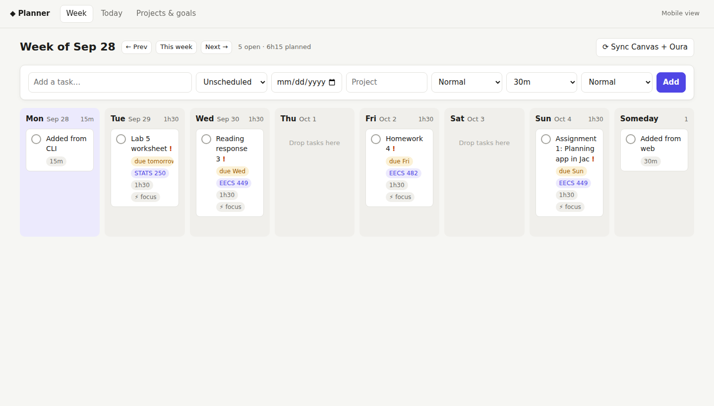
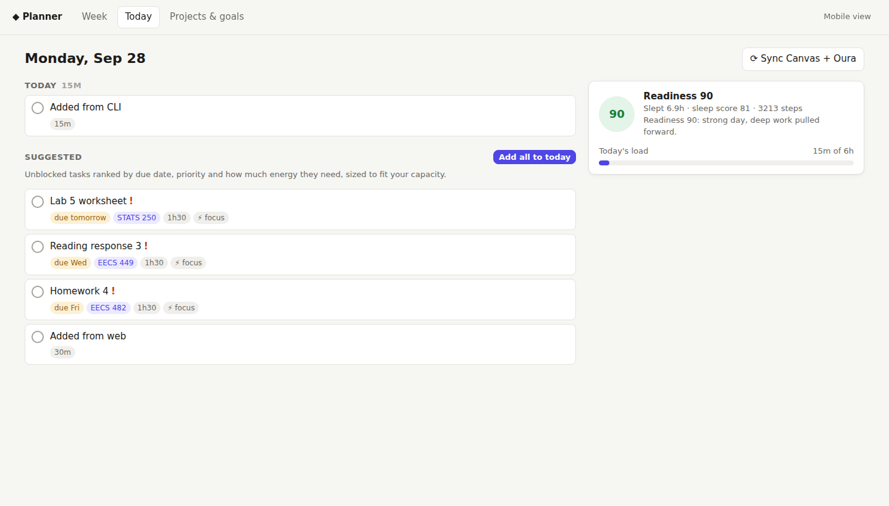
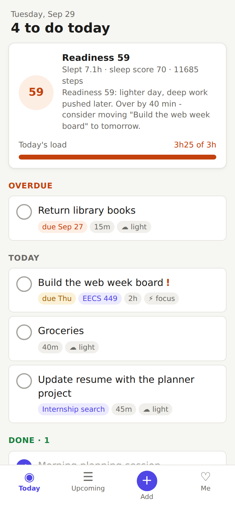
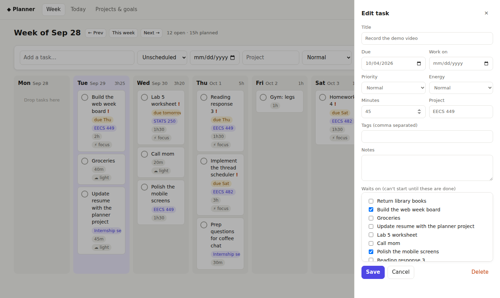
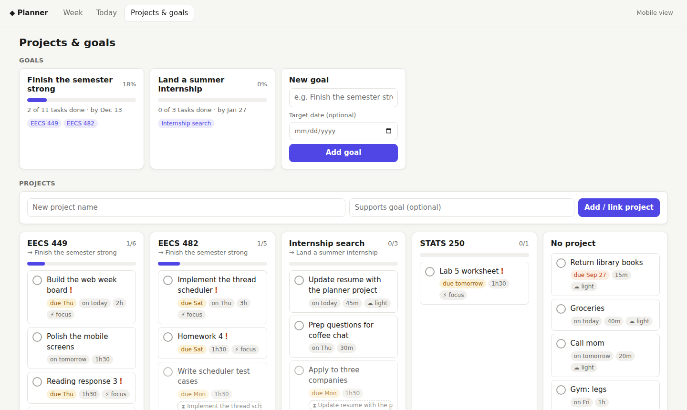
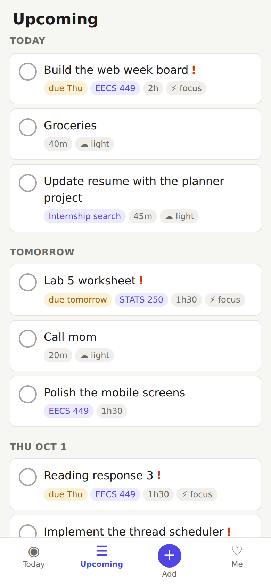

# Planner: a readiness-aware, graph-based planner in Jac

**Name:** Sawda Mim (uniqname: sawdam)  
**UMID:** 95969742  
EECS 449, Assignment 1

## What it is

Planner is a personal planner that knows **what blocks what** and **how much you can realistically do today**. Your tasks, projects and goals live in a graph on a Jac server, and four clients share it: a server, a web app, a mobile app and a CLI.

| Web: week board | Web: today | Mobile: today |
|---|---|---|
|  |  |  |

### Main features

- **Readiness-aware daily plan.** *Today* lists what's overdue and what's due, then fills the rest of the day with the best unblocked tasks. How much it plans depends on your readiness score: about 6h on a strong day, 5h on a normal day, 3h on a low one. Deep-focus work moves later when you're tired. If you've overbooked, it tells you which task to move.
- **Tasks that wait on other tasks.** A task can wait on others ("Record the demo video" waits on "Build the web board" and "Polish mobile screens"). Blocked tasks are marked everywhere, *Next up* shows only what you can start now, and a link that would create a loop is refused.
- **Week planning board.** A Mon–Sun board plus a *Someday* column. Drag tasks between days, and click any task to edit everything about it.
- **Check off without losing track.** Ticking a task crosses it out with a red line but leaves it where it was, so you can see what you've done. Tick it again to un-cross it. **Clear completed** (on every page, and `./plan clear`) hides all crossed-out tasks at once. They still count toward project and goal progress.
- **Projects and goals.** Tasks belong to projects, and projects support goals. Goal progress rolls up automatically.
- **Google Calendar + real free time.** A *Calendar* tab shows your week as timelines: sleep, meals, your Google Calendar events, and the free time left between them. Your day runs from when you woke up (Oura) to tonight's bedtime (Oura's optimal bedtime). Meals and events come out of that, and what's left is your time for to-dos. Each day compares that free time with its to-do load, and *Today* never plans more than the free time you have left.
- **Canvas and Oura.** Canvas assignments become tasks, with the course as the project. Oura sleep, readiness and recommended bedtime shape the plan. Canvas, Oura and Google Calendar all work out of the box with realistic mock data, and syncing twice never duplicates anything.
- **Four clients, one plan.** A task added in the terminal shows up on the web board and your phone. Check it off on your phone and the CLI sees it. There's no sign-in: everyone connected to the server shares the same plan.

## Setup

### Prerequisites

- **Python 3.12 or newer** (on a Mac: `brew install python@3.12`)
- **Node.js or Bun**, used to build the web client (on a Mac: `brew install node`)

### Install (once)

From the repository root:

```bash
python3.12 -m venv .venv
source .venv/bin/activate
pip install jaseci        # Jac + jac-scale (server) + jac-client (web/mobile)
```

The first `jac run` also installs the web client's npm packages automatically (you can run `jac install` to do that ahead of time).

No other configuration is needed. Canvas and Oura use mock data unless you set the optional variables described under [Integrations](#integrations-optional).

## Run the server and web app

```bash
source .venv/bin/activate   # if it isn't already
jac run
```

`jac run` starts the Jac server and the web app (it is configured as a full-stack Jac app in `jac.toml`, so this is equivalent to `jac start main.jac --dev`). Once it prints **Server ready**, open **http://localhost:8000**. Keep this terminal open while you use the app. The data is saved in `.jac/data/` and is still there after a restart.

Shortcut: `./start.sh` does the install steps above (only if needed) and then runs `jac run`.

**Load sample data (recommended for a first look):** click **Load demo week** on the empty web board, or run `./plan demo`. This loads 16 tasks, 2 goals, waiting chains, Canvas assignments, a week of readiness data and a sample calendar. Running it again replaces only the demo tasks.

**Using the web app:**

- **Week** (`/`): drag tasks between days. Click a task to edit its dates, priority, energy, project, tags and what it *waits on*. Tick the circle to finish it: it stays in place, crossed out in red, and ticking it again un-crosses it. **Clear completed** hides every finished task. The quick-add bar is at the top.
- **Today** (`/today`): overdue, today and suggested tasks, with a readiness card, the free time you have left today, and a load meter. *Add all to today* schedules the suggestions.
- **Calendar** (`/calendar`): the week as timelines of sleep, meals, events and free time. Each day shows its free hours against its to-do load, and you can tick off to-dos from here too. **⚙ Settings** connects Google Calendar and sets your meal times and sleep need.
- **Projects & goals** (`/projects`): create goals, link projects to them, and watch progress roll up.

## Mobile app

The mobile app is the same Jac client with a phone layout (`/m`), connected to the same server.

**On a phone (no extra setup):**

1. Start the server with `jac run` on your computer.
2. Put the phone on the **same Wi-Fi** and open `http://<your-computer's-IP>:8000`. On a Mac, `ipconfig getifaddr en0` prints the IP, and `./start.sh` prints the full link. Phones open the mobile layout automatically.
3. No phone handy? Open http://localhost:8000/m in a browser, or click **Mobile view** in the web app's top bar.

**Using it:** there are four tabs.

- **Today:** tap a circle to cross a task out, and tap again to undo. *Plan my day* accepts the suggestions, and **Clear completed** hides finished tasks.
- **Upcoming:** the next 7 days.
- **Calendar:** one day's timeline and its free time; tap the day chips to move through the week.
- **+ Add:** type a title, then tap chips for when, how long and how much energy.
- **Me:** 7 days of readiness, *Sync all*, *Load demo week*, and the switch to the desktop view.

**Optional: build a native iOS or Android app** from the same code with Capacitor. This needs Xcode (iOS) or Android Studio (Android).

```bash
# In jac.toml, set [plugins.client.api] base_url to an address the phone can reach,
# e.g. base_url = "http://192.168.1.25:8000", and keep the server running with `jac run`.
jac setup mobile --platform ios            # one time (or: --platform android)
jac build --client mobile --platform ios   # builds the app (Android: an .apk in android/app/build/outputs/apk/)
npx cap open ios                           # open in Xcode to run it on a simulator/device
```

The native app opens straight into the mobile layout, and the server accepts its cross-origin requests.

## CLI

The CLI (`cli/plan.jac`) talks to the same server over REST. Run it from the repository root in a **second terminal** while `jac run` is running. The `./plan` wrapper uses `.venv` automatically.

```bash
./plan status                 # which server, and is it reachable?
./plan demo                   # load the demo week

./plan today                  # today's plan: overdue / today / suggested, readiness, load vs capacity
./plan today --commit         # schedule the suggestions onto today
./plan next                   # what you can start right now (nothing blocking it)
./plan week                   # the week, day by day

./plan add Finish HW 4 -p "EECS 482" -d fri -P 1 -e high -t 120
./plan add Groceries -o today -e low --tags errand
./plan ls                     # numbers the tasks 1, 2, 3...
./plan done 2                 # ...so you can refer to them by number (./plan done -u 2 un-crosses it)
./plan clear                  # hide all completed tasks
./plan dep 3 1                # task 3 waits on task 1
./plan sched 4 tomorrow       # move a task to another day
./plan edit 4 -t 45 --tags school

./plan projects               # progress bars;  ./plan projects "EECS 449" --goal "Finish strong"
./plan goals                  # goals and their projects
./plan cal                    # today's free time: events, meals and free blocks until bedtime
./plan cal -w                 # free time vs to-dos for each day this week
./plan sync all               # Canvas + Oura + Google Calendar (mock unless configured)
./plan health                 # the last 7 days of readiness and sleep
./plan help                   # every command
```

- **Options:** `-d` is the due date, `-o` the day to work on it, `-p` the project, `-P` the priority (1–3), `-t` the minutes, `-e` the energy (high/normal/low), and `-a` the task(s) it waits on.
- **Dates:** you can write `today`, `tomorrow`, `mon`..`sun`, `+3` or `2026-10-01`.
- **Another server:** run `./plan server http://host:port` to use a different server.

## How the four parts fit together

```
             ┌──────────── Jac server (jac run) ─────────────┐
 CLI ──REST──▶│ walkers: PlanDay, NextActions, AddTask, ...    │
 Web ──spawn─▶│        ↓ traverse ↓                           │
 Mobile ─────▶│ graph: Task ─PartOf→ Project ─Supports→ Goal  │
             │        Task ─DependsOn→ Task, HealthSnapshot   │
             └──────── persisted in .jac/data ────────────────┘
```

- **Server** (`main.jac`, `services/`): all planning logic lives here, as walkers that move through the graph. `PlanDay` gathers open tasks and ranks them against your readiness. `ReachesTask` walks `DependsOn` edges to catch loops. Goal progress is counted over `Supports` and `PartOf` edges. Every walker is a public REST endpoint (`POST /walker/<Name>`, with docs at `/docs`).
- **Web and mobile** (`routes/`, `components/`): one Jac client app with two layouts. Every call goes through `components/api.cl.jac`, which runs the same walkers from the browser (`root spawn`).
- **CLI** (`cli/plan.jac`): calls the same walkers over HTTP. It decodes the replies into the same typed view objects the server defines in `services/models.jac`, so the server and CLI share one definition of the data.
- **Integrations** (`services/integrations.jac`, `services/calendar.jac`): write Canvas assignments, Oura readiness/sleep and Google Calendar events into the graph. `services/calendar.jac` also builds each day's time budget (wake → events + meals → bedtime), which `PlanDay` uses as a cap.

Because the planning logic lives only in the walkers, the three clients can't disagree about what's due, what's blocked or what fits today.

### What makes it impressive

- **It plans for you instead of just storing lists.** Readiness sets the day's capacity, the order depends on due dates, priority and energy fit, and an overbooked day gets a concrete suggestion of what to move.
- **It uses Jac's graph model for real.** Dependencies, cycle checks and progress rollups are graph traversals, not SQL-style lookups.
- **Each client suits its job.** The web app is for planning (drag-and-drop week, full editor, goals). The mobile app is for doing (big tap targets, one-tap add, tabs; it also builds as a native app). The CLI is for speed (`./plan add ...`, `./plan done 2`).
- **Real inputs.** Canvas and Oura, with mock data so it works immediately.
- **Polish and reliability.** Light and dark themes, empty states, clear error messages, idempotent syncs, data that survives restarts, 12 automated walker tests (`jac test`), and the whole web + mobile + CLI flow checked in a browser from a fresh checkout.

| Task editor ("waits on") | Projects & goals | Mobile: upcoming |
|---|---|---|
|  |  |  |

## Integrations (optional)

### Google Calendar

The easiest way is in the app: open **Calendar → ⚙ Settings**, paste your calendar's private link, and click **Save & sync**. To get the link:

1. Open [Google Calendar](https://calendar.google.com) on a computer and click ⚙ → **Settings**.
2. Under **Settings for my calendars** (left side), click the calendar you want.
3. Scroll to **Integrate calendar** and copy **Secret address in iCal format** (it ends in `basic.ics`).

The link is stored on your planner server and never sent back to the browser. Anyone with the link can read your calendar, so don't commit it or share it. Repeating events (weekly classes and so on), edited or cancelled occurrences, all-day events and time zones are handled. Events marked *Free* ("show as available") and all-day events are shown but don't use up time. Each sync covers the past week and the next 8 weeks, and it replaces the events in that window, so edits and deletions in Google show up too.

**How free time is worked out:** the day starts when you woke up (from Oura; for future days, the previous night's bedtime plus your sleep need) and ends at tonight's bedtime (Oura's optimal bedtime, else your average bedtime, else 11pm). Meals (default 8:00 for 30m, 12:30 for 45m and 18:30 for 60m; change them in Settings) and busy events are taken out, and gaps shorter than 15 minutes don't count. A meal that clashes with an event moves to right after it. On *Today*, the plan uses whichever is smaller: what your readiness allows, or the free time left between now and bedtime.

### Environment variables

Set these before `jac run` to use real data instead of mock data:

| Variable | Where to get it |
|---|---|
| `CANVAS_ICS_URL` | Canvas → Calendar → **Calendar Feed** (a private link; don't commit it) |
| `OURA_ACCESS_TOKEN` | An OAuth2 access token for the Oura API v2 |
| `GOOGLE_CALENDAR_ICS_URL` | Optional: the Google Calendar link above, if you'd rather not paste it in the app |

> The Oura code uses the v2 endpoints (`daily_readiness`, `daily_sleep`, `sleep`, `sleep_time`, `daily_activity`) but hasn't been tried with a live account. Bedtime and wake time come from `sleep`, and the optimal bedtime comes from `sleep_time`.

## Tests

```bash
jac test      # walker tests: CRUD, dependencies, cycles, capacity, idempotent sync, demo data,
              # calendar parsing (repeats, skipped/moved events), free-time budget, Oura bedtime
```

Tests run on their own test root and never touch the planner's real data.

## Troubleshooting

- **http://localhost:8000 doesn't load:** the server must be running. Keep the `jac run` terminal open and wait for the URLs to print (the first start builds the web app).
- **"Port already in use":** another copy is probably running. Stop it, or free ports 8000 and 8001.
- **`./plan` says it can't reach the server:** start `jac run` first. `./plan status` checks the connection.
- **The phone can't connect:** make sure the phone and computer are on the same Wi-Fi, and that you used the computer's IP address, not `localhost`.

## Project layout

```
main.jac                   entry point: registers the walkers + the client route table
services/models.jac        graph nodes/edges and view objects (the shared data contract)
services/planner.jac       task, planning, project and goal walkers
services/integrations.jac  Canvas + Oura sync
services/calendar.jac      Google Calendar sync (iCal parser) + daily free-time budget
services/demo.jac          LoadDemo: the sample week
components/                shared UI + api.cl.jac (all client → walker calls)
routes/                    web pages (WebShell, WeekPage, TodayPage, CalendarPage, ProjectsPage) and mobile screens (Mobile*)
styles/global.css          styles for web + mobile (light/dark)
cli/plan.jac, plan         the CLI and its wrapper
tests/planner_tests.jac    walker tests
start.sh                   optional one-step setup + jac run
jac.toml                   project config (jac run → server + web app; mobile settings)
```
